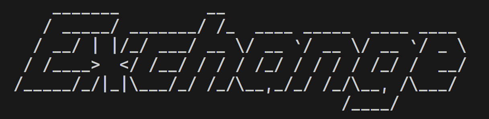

# exchange-cli



`exchange-cli` is a command-line tool for currency conversion, designed for educational purposes to explore web scraping, CLI tool development, and parallel processing.

## Table of Contents

- [Main Features](#main-features)
- [Usage](#usage)
  - [Basic Usage](#basic-usage)
  - [Available Commands](#available-commands)
  - [Flags](#flags)
- [Installation](#installation)
    - [Using Pre-Compiled Binaries](#using-pre-compiled-binaries)
    - [Building from Source](#building-from-source)
- [Contributing](#contributing)
- [License](#license)
- [Disclaimer](#disclaimer)
- [Contact](#contact)


## Main Features

- **Currency Conversion**: Convert amounts between different currencies.
- **List Currencies**: Retrieve a list of all supported currency codes.
- **Update Rates**: Update exchange rates from [x-rates](https://www.x-rates.com/).


## Usage

### Basic Usage

To convert currencies, use the following format:

```bash
exchange-cli <amount> <base> <target>
```

Example:
```bash
exchange-cli 100 USD EUR
```

### Commands

- `list`: List all country units.
```bash
exchange-cli list
```

- `update`: Update the currency exchange rates through scrapping [x-rates](https://www.x-rates.com/).
```bash
exchange-cli update
```

### Flags

- `-h, --help`: Display help for the command.
- `-v, --version`: Display the version of the program.


## Installation

To install `exchange-cli`, follow these steps:

### Using Pre-Compiled Binaries
Pre-compiled binaries are available for Linux, macOS, and Windows. Download the appropriate binary for your operating system and CPU architecture:

```bash
git clone https://github.com/junjie1999/exchange-cli.git
cd exchange-cli/bin/YOUR_OPERATING_SYSTEM
./exchange-cli_YOUR_CPU_ARCH
```

Replace `YOUR_OPERATING_SYSTEM` with `linux`, `macos`, or `windows`, and `YOUR_CPU_ARCH` with `amd64` or `arm`.

### Building from Source
Alternatively you can build the binary yourself. Ensure you have Go installed, then clone the repository and build it yourself:

```bash
git clone https://github.com/junjie1999/exchange-cli.git
cd exchange-cli
go build -o exchange-cli
```

## Contributing
Feel free to contribute by submitting issues or pull requests.

## License

This project is licensed under the MIT License with additional restrictions. See the [LICENSE](LICENSE) file for details.

## Disclaimer

This project is strictly for educational and learning purposes only. It is not intended for commercial use, production environments, or any application that may violate the terms of service of x-rates.com or any other website. Users of this tool are responsible for ensuring they comply with all applicable laws and terms of service.


## Contact
For questions or issues, please contact me at junjie9931@gmail.com or open an issue on the [GitHub repository](https://github.com/junjie1999/exchange-cli).
